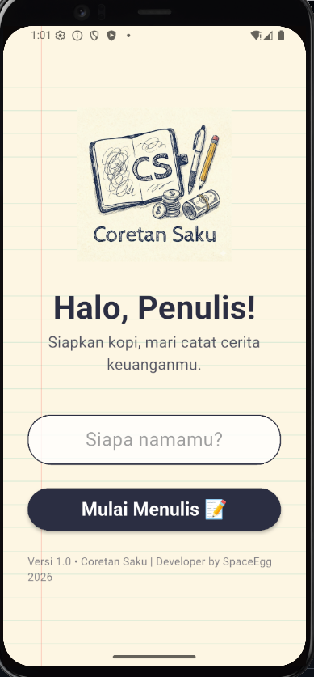
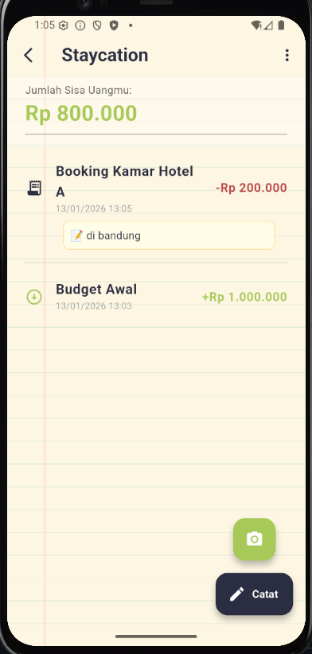

# 📝 Coretan Saku (Pocket Scrawls)

> **Jurnal keuangan personal dengan sentuhan nostalgia dan kecerdasan buatan.**

**Coretan Saku** mengubah kegiatan mencatat keuangan yang membosankan menjadi pengalaman yang menyenangkan. Dengan estetika buku tulis sekolah dan tulisan tangan, aplikasi ini terasa seperti buku harian pribadi, namun dibekali kecerdasan buatan (AI) untuk mempermudah pencatatan.

---

## 📸 Screenshots

<p align="center">
  
  
  
</p>

---

## 💡 Latar Belakang & Ide

Kebanyakan aplikasi keuangan saat ini terasa kaku, terlalu serius, dan membosankan (seperti tabel Excel).
**Coretan Saku** hadir sebagai antitesis:

- **Masalah:** User malas mencatat karena aplikasinya tidak "mengundang".
- **Solusi:** Pendekatan UI yang hangat (Warm UI) menggunakan tekstur kertas dan font tulisan tangan.
- **Visi:** Menjadikan finansial sebagai cerita, bukan sekadar angka.

---

## 🎨 Design System

- **Konsep:** Skewmorphism (Buku Tulis Sekolah).
- **Typography:** [Patrick Hand](https://fonts.google.com/specimen/Patrick+Hand) (Google Fonts).
- **Color Palette:**
  - 📄 **Paper:** `#FDF6E3` (Creamy White)
  - 🖋️ **Ink:** Dark Blue/Black
  - 🟢 **Income:** Highlighter Green
  - 🔴 **Expense:** Marker Red
  - 🔵 **Todo:** Ballpoint Blue

---

## ✨ Fitur Utama (v1.0)

### 1. 🏠 Personalized Landing

Sapaan hangat dengan nama pengguna (Contoh: _"Abdul's Diary 2026"_).

### 2. 🤖 AI Receipt Scanner (Powered by Gemini 1.5 Flash)

Fitur unggulan untuk malas ketik!

- Foto struk belanja -> AI otomatis membaca.
- Ekstraksi **Nama Toko**, **Total Belanja**, dan **Rincian Item**.
- Auto-retry mechanism jika server sibuk.

### 3. 📂 Smart Dashboard

- **Dynamic Counter:** Penomoran lembaran otomatis (#1, #2, dst).
- **Pin/Favorite:** Sematkan lembaran penting di paling atas.
- **Swipe-to-Delete:** Gestur natural untuk menghapus data.

### 4. 📝 Interactive Editor

- **Color-Coded:** Indikator warna otomatis untuk Pemasukan (+) dan Pengeluaran (-).
- **Item Detail:** Dropdown untuk melihat rincian barang per transaksi.
- **Real-time Balance:** Saldo sisa terhitung otomatis di header kertas.

---

## 🛠️ Teknologi (Tech Stack)

- **Framework:** [Flutter](https://flutter.dev/) (Dart)
- **State Management:** [Provider](https://pub.dev/packages/provider)
- **Artificial Intelligence:** [Google Gemini API](https://ai.google.dev/) (via `google_generative_ai`)
- **Local Persistence:** `shared_preferences`
- **Environment:** `flutter_dotenv` (Keamanan API Key)
- **Camera:** `image_picker`

---

## 🚀 Cara Menjalankan (Installation)

1.  **Clone Repository**

    ```bash
    git clone [https://github.com/username-anda/coretan-saku.git](https://github.com/username-anda/coretan-saku.git)
    cd coretan-saku
    ```

2.  **Install Dependencies**

    ```bash
    flutter pub get
    ```

3.  **Setup Environment Variable**
    Buat file `.env` di root folder dan masukkan API Key Gemini Anda:

    ```env
    GEMINI_API_KEY=Kunci_Rahasia_Anda_Disini
    ```

4.  **Run App**
    ```bash
    flutter run
    ```

---

## 🤝 Credit

Dibuat dengan ❤️ dan ☕ oleh Developer SpaceEgg 🚀🥚
